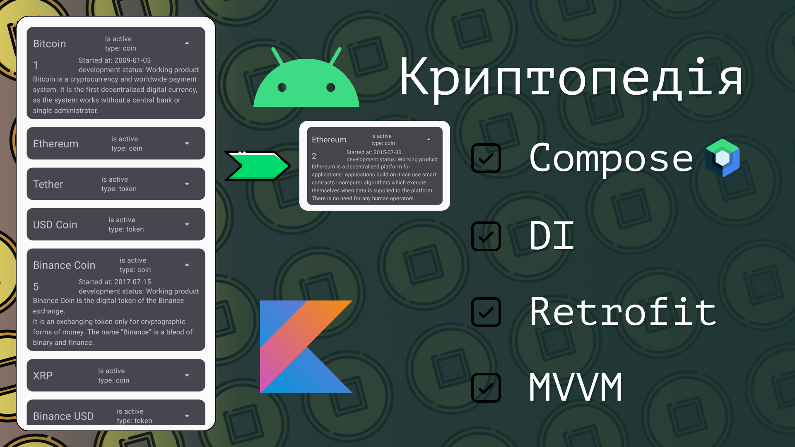

# Crypto-Compose

This app executes network call to [CoinPaprika API](https://api.coinpaprika.com/) and gets info about Cryptocurrencies. The goal of the sample is to
showcase loading data from network with `Retrofit`, implementing `DI` and async programming with `Coroutines`.

### YouTube tutorial 👉🏼  <a href="https://youtu.be/IWzwG4OFfAM" target="blank"></a>





### What I used in this project:

- [`Jetpack Compose`](app/src/main/java/com/cherry/cryptocompose/presentation/CoinItem.kt)
- [`Koin DI`](app/src/main/java/com/cherry/cryptocompose/di)
- [`Retrofit`](app/src/main/java/com/cherry/cryptocompose/data/remote/CoinApi.kt)
- `Coroutines`

### Rotation of icon and visibility animation:

``` kotlin
    var isVisible by remember { mutableStateOf(false) }
    val rotation by animateFloatAsState(targetValue = if (isVisible) 180f else 0f)
    
    Icon(imageVector = Icons.Rounded.ArrowDropDown, modifier = Modifier.rotate(rotation))
    
    AnimatedVisibility(visible = isVisible) {
    //content to be hidden and shown on Icon click
    }
```

**only 25 coins and tokens are loaded because API provides a huge list of coins. It takes too much time to load data.*
